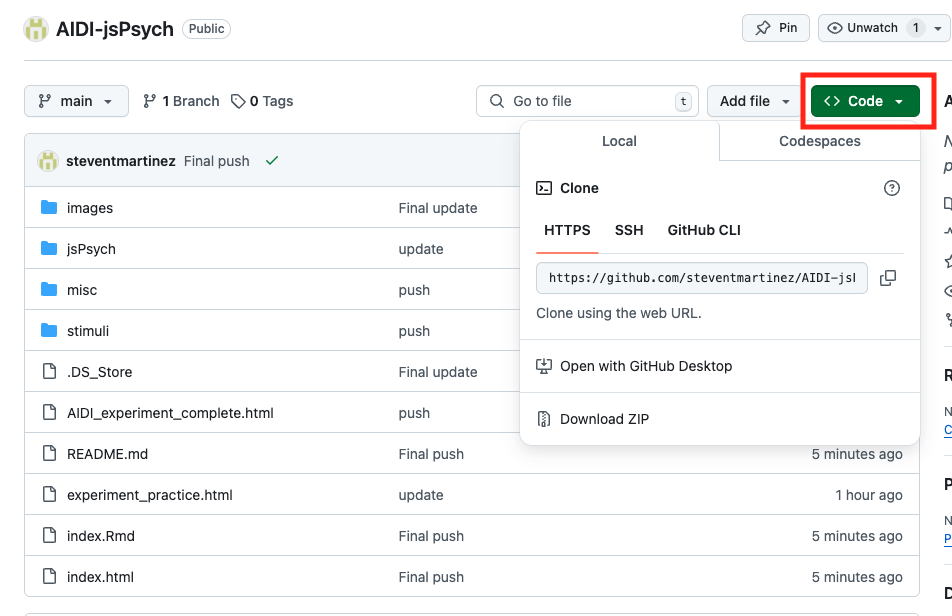

# AIDI Workshop: Intro to jsPsych
12/17/2024

__**Content creator:**__ Steven Martinez

### [Full Workshop Recording](https://tuprd-my.sharepoint.com/:v:/r/personal/jchein_temple_edu/Documents/CABLAB/Projects/Interventions%20for%20AI%20Detection/AIDI-jspsych%20workshop%20recording.mp4?csf=1&web=1&e=gqgbnr)

## Description
This workshop will cover how to use [jsPsych version 8.1.0](https://github.com/jspsych/jsPsych/releases/tag/jspsych%408.1.0) to build psychological experiments. jsPsych is a free, open-source software that employs a JavaScript framework for creating behavioral experiments that run in a web browser. It's a popular alternative to PsychoPy and E-Prime for task development, is used primarily in behavioral tasks, and supports online study capabilities.  

## Set Up (do before the workshop)

1) Download the GitHub folder by clicking the green **Code** button and clicking the **Download ZIP** option. This folder has all the materials you will need for the workshop, including **jsPsych** version 8.1.0 (The jsPsych software is a set of files located in the jspsych/dist folder), the **stimuli** located in the stimuli folder, and the **experiment_practice.html** script which is the main script we will be working with today.

2) Download Visual Studio Code, which is a programming-friendly text editor that works with Windows, OSX/Mac, and Linux, and can be downloaded at the following link:  https://code.visualstudio.com/Download

## Workshop materials:
- [Notebook Viewer](https://steventmartinez.github.io/AIDI-jsPsych/index.html)

## Outline
| Topic | Description 
| :---: | :---: 
| Workshop Overview | Set Up & Prerequisites
| Setting Up Visual Studio Code | Open AIDI-jsPsych folder in VS Code
| Setting Up jsPsych | Learning how to integrate Javascript, HTML, and CSS 
| Experimental Templates | Trials, Procedures, and Timelines 
| Surveys and Questionnaires | Likert-style, multiple choice, multiple select, open-ended

