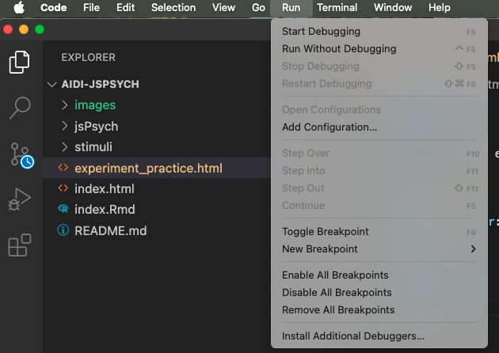

```{r setup, include=FALSE}
knitr::opts_chunk$set(echo = TRUE, error = FALSE)
```


# Description

This workshop will cover how to use [jsPsych version 8.1.0](https://github.com/jspsych/jsPsych/releases/tag/jspsych%408.1.0) to build psychological experiments. jsPsych is a free, open-source software that employs a JavaScript framework for creating behavioral experiments that run in a web browser. It's a popular alternative to PsychoPy and E-Prime for task development and can be used for behavioral tasks, neuroimaging tasks, and online studies.


## Outline

| Topic | Description 
| :---: | :---: 
| Workshop Overview | Set Up & Prerequisites
| Setting Up Visual Studio Code | Open AIDI-jsPsych folder in VS Code
| Setting Up jsPsych | Learning how to integrate Javascript, HTML, and CSS 
| Experimental Templates | Trials, Procedures, and Timelines 
| Surveys and Questionnaires | Likert-style, multiple choice, multiple select, open-ended


# Workshop Overview

## Set Up & Prerequisites

Before the workshop: 

1) Download the GitHub folder by clicking the green **Code** button and clicking the **Download ZIP** option. This folder has all the materials you will need for the workshop, including jsPsych version 8.1.0 (The jsPsych software is a set of files located in the jspsych/dist folder), the stimuli, and the experiment_practice.html script which is the main script we will be working with today.

2) Download Visual Studio Code, which is a programming-friendly text editor that works with Windows, OSX/Mac, and Linux, and can be downloaded at the following link:  https://code.visualstudio.com/Download


# Setting Up Visual Studio Code

## Open AIDI-jsPsych folder in VS Code

To get things started, let's open the **AIDI-jsPsych** folder in Visual Studio Code Editor. In Visual Studio Code, click the "File" tab then the "Open Folder" tab and navigate to wherever you have the **AIDI-jsPsych** folder downloaded. 

Once you open the **AIDI-jsPsych** folder, you may have to click the Folder icon in the top left to see the full directory.

Here's what your directory should look like once you've opened up the **AIDI-jsPsych** folder in Visual Studio Code.


{width=40%}


# Setting Up jsPsych

Today's workshop will start with an introduction to the syntax structure that jsPsych uses, which includes HTML, CSS, and JavaScript.

**HTML** stands for HyperText Markup Language and is the code that is used to structure a web page and its content.<br>

**CSS** stands for Cascading Style Sheets language and is the code that is used to stylize/customize elements that appear on the HTML page.<br>

**JavaScript** is the programming language that is used to make interactive webpages. Ultimately, jsPsych, through JavaScript, has built-in plugins that work with HTML and CSS capabilities in order to make a web page functional. Think clicking buttons, submitting keyboard responses, viewing images, etc.

We'll be using HTML, CSS, and JavaScript together throughout out experiment. Before we do that, let's get our script set-up!


## Create an HTML file

First, let's open up the **experiment_practice.html** file in the AIDI-jsPsych folder. This is a completely empty script, but we will use this script to start putting our experiment together.

To get things started, we need to add some basic code that all HTML documents have in common. This HTML code allows JavaScript to run scripts on a web page.

```
<!DOCTYPE html>
<html>
  <head>
    <title>AIDI experiment -- practice</title>
  
<style>
      body {
background-color: #F0F0F0;
     } 
</style>
  </head>
  <body></body>
</html>

```

This code may look like a lot, but really isn't doing that much. All we are doing here is saying: make an HTML document with a gray background (background-color: #F0F0F0) and make the title of the web page tab "AIDI experiment -- practice".

Next, let's run the script so we can see what the web page actually looks like!

## Test your script

In Visual Studio Code, click the "Run" button in the top toolbar and then click "**Start Debugging**". A pop-up may appear indicating which browser you want to run the script in. Click your preferred browser. 


{width=50%}

At this point, a blank web page should appear and the title of the tab will be "**AIDI experiment -- practice**". 

{width=50%}

## Load in jsPsych libraries, task stimuli, jsPsych CSS file

To use jsPsych, we need to load in the plugins that will let us use different functions (i.e., collecting keyboard responses, button responses, etc.)

To load a plugin, we need to add a \<script\> \<\/script\> tag. These tags work like parentheses, such that a script tag needs to be opened, filled with text, and then closed.

To make things easier, I've filled in the script tags for us. 

In the **Load Psych libraries** section, you can see that I am pulling files from the jspsych/Dist folder. The jsPsych.js file is the main jsPsych program. The different plugins (plugin-instructions.js, plugin-html-button-response.js, plugin-survey-text.js, etc) contain the different functions that we will use to build our experiment.

In the **Load task stimuli from the CSV we made** section, I've converted the CSV file that we'll use to store our stimuli into a JS file, so that we can use it to load in our stimuli for the experiment.

In the **Load jsPsych's default CSS styling script (which handles aesthetics)**, I've loaded in jsPsych's default CSS file. As a reminder, CSS is the code that is used to stylize/customize elements that appear on the HTML page, and the jsPsych creators developed their own CSS code for the purposes of jsPsych.

```
<!DOCTYPE html>
<html>
  <head>
    <title>AIDI experiment -- practice</title>

    <!-- Load jsPsych libraries -->
    <script src="jspsych/dist/jspsych.js"></script>
    <script src="jspsych/dist/plugin-instructions.js"></script>
    <script src="jsPsych/dist/plugin-html-button-response.js"></script>
    <script src="jspsych/dist/plugin-survey-text.js"></script>
    <script src="jspsych/dist/plugin-survey-likert.js"></script>
    <script src="jspsych/dist/plugin-survey-multi-choice.js"></script>
    <script src="jspsych/dist/plugin-survey-multi-select.js"></script>
    <script src="jspsych/dist/plugin-html-slider-response.js"></script>
    
    <!-- Load task stimuli from the CSV we made -->
    <script src="stimuli/JS files/AIDI_stim.js"></script>

    <!-- Load jsPsych's default CSS styling script (which handles aesthetics) -->
    <link href="jspsych/dist/jspsych.css" rel="stylesheet" type="text/css" />
  
<style>
      body {
background-color: #F0F0F0;
     } 
</style>
  </head>
  <body></body>
</html>
```


## Initialize jsPsych

To add JavaScript code directly to the webpage, we will need to add a pair of \<script\> \<\/script\> tags after the \<body\> tags. Anything that is included in between these \<script\> \<\/script\> tags will define the experimental script.

To initialize jsPsych, we will need to use the initJsPsych() function, and save it to a variable called "jsPsych".

All jsPsych experiments are defined by a timeline. The timeline is an array that contains the set of trials we want to run in the experiment. At the very end of the script, you'll see the command **jsPsych.run(timeline)**. This command runs the entire experiment.

Every jsPsych experiment starts off by creating a variable called "timeline" and assigning empty brackets to reflect an empty timeline array. We'll push/add trials to this timeline array as we create them.

We'll talk more about timelines after we make our first Text Instructions trial.

```
<!DOCTYPE html>
<html>
  <head>
    <title>AIDI experiment -- practice</title>

    <!-- Load jsPsych libraries -->
    <script src="jspsych/dist/jspsych.js"></script>
    <script src="jspsych/dist/plugin-instructions.js"></script>
    <script src="jsPsych/dist/plugin-html-button-response.js"></script>
    <script src="jspsych/dist/plugin-survey-text.js"></script>
    <script src="jspsych/dist/plugin-survey-likert.js"></script>
    <script src="jspsych/dist/plugin-survey-multi-choice.js"></script>
    <script src="jspsych/dist/plugin-survey-multi-select.js"></script>
    <script src="jspsych/dist/plugin-html-slider-response.js"></script>
    
    <!-- Load task stimuli from the CSV we made -->
    <script src="stimuli/JS files/AIDI_stim.js"></script>

    <!-- Load jsPsych's default CSS styling script (which handles aesthetics) -->
    <link href="jspsych/dist/jspsych.css" rel="stylesheet" type="text/css" />
  
<style>
      body {
background-color: #F0F0F0;
     } 
</style>
  </head>
  <body></body>

  <script>


//------------------------------------//
// Initialize jsPsych
//------------------------------------//
  var jsPsych = initJsPsych({
    on_finish: function() {
      jsPsych.data.displayData();
    }
  });


//------------------------------------//
// Initiate the jsPsych timeline
//------------------------------------//
  var timeline = []


//------------------------------------//
// Run the experiment
//------------------------------------//
jsPsych.run(timeline);

  </script>
</html>
```


# Experimental Templates

Now that we have jsPsych ready to go, we can start building the experiment! For the rest of the workshop, I'm going to show a template of some of the more common types of experimental modules (i.e., instructions, experimental trials, surveys/questionnaires). My hope is that we can use each of these modules as a template to build the AIDI experiment. 

Each of these experimental modules use a different jsPsych plugin. The creators of jsPsych were kind enough to provide documentation that includes a demo of how each plugin works. I'll list the documentation and demo for each plugin in the order that each plugin is shown in the script below. 

**jsPsychInstructions**: https://www.jspsych.org/v8/plugins/instructions/.<br>
**jsPsychHtmlButtonResponse**: https://www.jspsych.org/v8/plugins/html-button-response/.<br>
**jsPsychHtmlSliderResponse**: https://www.jspsych.org/v8/plugins/html-slider-response/.<br> 
**jsPsychSurveyLikert**: https://www.jspsych.org/v8/plugins/survey-likert/.<br> 
**jsPsychSurveyMultiChoice**: https://www.jspsych.org/v8/plugins/survey-multi-choice/.<br> 
**jsPsychsurveyMultiSelect**: https://www.jspsych.org/v8/plugins/survey-multi-select/.<br> 
**jsPsychSurveyText**: https://www.jspsych.org/v8/plugins/survey-text/. 


Let's try going through each type of experimental module one at a time.


## Text Instructions

To start an experiment, it's pretty common to show a welcome message. jsPsych has an [instructions](https://www.jspsych.org/v8/plugins/instructions/) plugin that makes showing instructions pretty straightforward.

Copy this code and paste it a few rows under the **var timeline = []** code.

```
//------------------------------------//
// Text Instructions 
//------------------------------------//
var welcome = {
    type: jsPsychInstructions,
    pages: function(){
    pageOne = "<p><div style ='font-size:2.5vw;'>Welcome to the experiment.</div></p>" +
    "<p><div style ='font-size:5vw; color: green;'>Click next to begin.</div></p>"
     return [pageOne]
  },
  show_clickable_nav: true
}
```


Here's what the code to show instructions looks like. Let's break down each part of the code:

**var welcome**: Create a trial object object called "welcome"<br>
**type**: The name of the jsPsych plugin we are using for this trial; in this case, we are using the jsPsychInstructions plugin.<br>
**pages:** This part is a bit funky, but all we're doing here is defining the text we want to show to participants. Each line of code represents a separate line of text.<br>
**show_clickable_nav**: Show the previous/next buttons

In the **pages** lines of code, you'll see that we are using CSS formatting to customize what the text looks like (i.e., font-size, color). Learning how to incorporate CSS formatting is a very important part of jsPsych. We'll talk about that more soon.

The \<p\> \<\/p\> tag is used for text.
The "style" attribute on a \<p\> tag assigns a unique style to that text.
Here, we are using the "style" attribute to change the "font-size" parameter to 2.5vw (we'll get more into what vw means later) and the "color" parameter to green.


## Pushing trial to timeline

This is arguably the most important part of working with jsPsych! In order to add the **welcome** trial to the experiment, we will need to push it to the empty timeline array [] that we created earlier.

By pushing the welcome trial to the timeline, this will add the the trial to the experiment.

Copy this code and paste it under the **Text Instructions** code chunk.

```
timeline.push(welcome);
```

Think of timeline.push(welcome) as changing our timeline array from **timeline = [];** to **timeline = [welcome];**.

Now let's try running the experiment and see what things look like.

As a reminder, click the "Run" button in the top toolbar of Visual Studio Code and then click "Start Debugging". A pop-up should appear indicating which browser you want to run the script in. Click your preferred browser. 

Hopefully you were able to see the welcome message in your web browser!

But if we want to show pictures and text together? So glad you asked.


## Text + Image Instructions

Let's go through a trial where we show text and an image together.

Copy this code and paste it a few rows under the **Text Instructions** code chunk.

As a reminder, we have to push each trial to the experiment, as seen in the final line of code in this chunk.

```
//------------------------------------//
// Text + Image instructions
//------------------------------------//
var experiment_instructions = {
    type: jsPsychInstructions,
    pages: function(){
      pageOne =  "<p><div style ='font-size:2.5vw;'>Next, you will see human- and AI-generated rental listings.</div></p>" +
      "<p><div style ='font-size:2.5vw;'>Your goal is to determine whether the rental listing</div></p>" +
      "<p><div style ='font-size:2.5vw;'>was generated by a human or AI.</div></p>" +
    "</img>"
     return [pageOne]
  },
  show_clickable_nav: true
}

timeline.push(experiment_instructions);
```


We can break down this code in more detail below:

**var experiment_instructions**: Create a trial object object called "experiment_instructions".<br>
**type**: The name of the jsPsych plugin we are using for this trial (still using the jsPsychInstructions plugin).<br>
**pages** The first 3 lines of this part of the code are the same as above, but as you can see, we added a 4th line to include the image of a question mark.<br>
**show_clickable_nav**: Show the previous/next buttons.

The image line of code looks a bit different compared to the texts. You'll see that we have to use </img> tags to load in images. We also used new CSS formatting here, which I'll describe more below:

**width**: Define the width of the image.<br>
**height**: Define the height of the image.<br>
**position**: Fixed (This means we want the image to always be in this position on everyone's computer screen).<br>
**right/left**: specify the horizontal positioning of the image.
**top/bottom**: specify the vertical positioning of the image.<br>

You also may be noticing that, rather than using pixels as the unit of measurement, we are using "vw" and "vh".

Whereas pixels are a fixed value, vw (for width) and vh (for height) take into account the relative size of an individual's computer screen. For example, a value of 10vw should look exactly the same on everyone's computer regardless of how big your computer screen is. This is especially important for online studies where everyone's computer screen is different.

Hopefully so far things are making sense! Next, let's shift to making an experimental trial for AIDI.


## Experimental trials

Okay unfortunately this will probably be the most complicated part of the workshop! Here we go (apologies in advance)

```
//------------------------------------//
// Rentals Trial
//------------------------------------//
var rentals_trial = {
type: jsPsychHtmlButtonResponse,
stimulus: () => {
  return `</img>` +
    `</img>` +
    `<p><div style ='font-size: 1.7vw; font-family: Arial; text-align: left; position: fixed; left: 24vw; width: 56vw; height: 30vh; bottom: 22vh; line-height: 1.2em; border: .3vw transparent; padding: 1vh;'>${jsPsych.evaluateTimelineVariable('text_stimuli')}</p>` 
},
choices: ["<p style ='font-size:2vw; position: fixed; left: 38vw; bottom: 8vh;'><b>Human</b></p>", "<p style ='font-size: 2vw;position: fixed; right: 41vw; bottom: 8vh'><b>AI</b></p>"],
button_html: (choice) => {
  return `<button class="jspsych-btn" style="width: 15vw; height: 8vh; position: relative; top: 35vh;">${choice}</button>`
  }
}

```


Let's go through each line of code to try and sort this out!

**var rentals_trial**: Create a trial object called "rentals_trial".<br>
**type**: The name of the jsPsych plugin we are using for this trial (the jsPsychHtmlButtonResponse plugin).<br>
**stimulus**: Yuck! This part looks very confusing. All we're doing here is pulling AirBnb texts (text_stimuli), rental pictures (place_stimuli) and faces (face_stimuli) and formatting each item to define width/height, positioning, etc.<br>
**choices**: Define the text that we want on each button, along with some CSS formatting to define the font-size and positioning of the text.<br>
**button_html**: Customize the width/height and positioning of each button.

Let's revisit the *stimuli* argument in this code chunk, because this is very important! We can find each variable (text_stimuli, place_stimuli, face_stimuli) by looking in the task stimuli JS file that we loaded in the beginning of the experiment (<script src="stimuli/JS files/AIDI_stim.js"></script>). This file represents the CSV file (which we then converted to the AIDI_stim.js file) that we used to store the texts and image pathways for rental pictures and face pictures. This is essentially the same as pulling "columns" from the CSV file.

The code above will work for 1 trial. But what if we want to loop through all of the text, places, and faces stimuli?

jsPsych makes that relatively easy for us. We can create an experimental "procedure" that has a timeline of its own, which in this case, reflects the rentals_trial that we created earlier. 

Using an experimental procedure, rather than a single experimental trial, involves a subtle difference in how things get pushed to the timeline. Rather than pushing the **rentals_trial** object that we created above to the timeline, we have to push the entire experimental procedure to the timeline!

```
//------------------------------------//
// Rentals Timeline Procedure
//------------------------------------//
var rentals_procedure = {
    timeline: [rentals_trial],
    timeline_variables: rentals_stim,
    };

timeline.push(rentals_procedure);
```


We can walk through this code together:

**var rentals_procedure**: Create an experimental procedure called "rentals_procedure".<br>
**timeline**: The name of the trial that will repeat for all the stimuli included in the CSV/JS file that we made.<br>
**timeline_variables**: The name of the array that contains all of the stimuli we will use.<br>

Then we push the entire procedure, which includes all the trials with all the stimuli from the CSV/JS file, to the timeline.

This section covers some of the more common experimental modules and can hopefully serve as a basis for us to start building the AIDI experiment. Just to quickly review, we covered the following modules:

**1)** Text instructions.<br>
**2)** Text + Image instructions.<br>
**3)** Experimental trials (Human/AI judgment task).<br>

We'll still need to play around with CSS formatting to make everything look extra nice, but that can be sorted out later!


# Surveys and Questionnaires

Next, we'll discuss how to prepare surveys and questionnaires! We'll go through a few different types of surveys together.

**1)** Likert-scale survey.<br>
**2)** Multiple choice survey.<br>
**3)** Multiple select survey.<br>
**4)** Open-ended text response.<br>


## Likert-scale survey

Let's start with surveys that use a Likert-style scale.

As part of this survey, we'll borrow from the Questionnaire of Cognitive and Affective Empathy (QCAE) survey which uses Likert-style question to assess people's trait-level empathy. Here is a breakdown of the code parameters:

**var QCAE_survey**: Create a trial object called "QCAE_survey".<br>
**type**: the name of the plugin for making Likert-scale surveys (jsPsychSurveyLikert).<br>
**preamble**: The header shown at the top of the page.<br>
**questions**: This array [] reflects all the questions that we will show participants.<br>
**prompt**: The question that you want to ask participants.<br>
**name**: The name/ID of the question.<br>
**labels**: The answer options for each question.<br>
**required**: true/false. Determines whether the question is required or participant can skip the question

```
//------------------------------------//
// Likert-scale survey
//------------------------------------//
var QCAE_survey = {
  type: jsPsychSurveyLikert,
  preamble: "<p style ='font-size: 2.2vw;'><b>Please answer all of the questions on this page.</b></p>",
  questions: [
    {prompt: "<b>1. I sometimes find it difficult to see things from the 'other person's' point of view.</b>", name: 'QCAE_Q1', labels: ["Strongly Disagree", "Slightly Disagree", "Slightly Agree", "Strongly Agree"], required: true},
    {prompt: "<b>2. I am usually objective when I watch a film or play, and I don't often get completely caught up in it.</b>", name: 'QCAE_Q2', labels: ["Strongly Disagree", "Slightly Disagree", "Slightly Agree", "Strongly Agree"], required: true},
    {prompt: "<b>3. I try to look at everybody's side of a disagreement before I make a decision.</b>", name: 'QCAE_Q3', labels: ["Strongly Disagree", "Slightly Disagree", "Slightly Agree", "Strongly Agree"], required: true},
]
}

timeline.push(QCAE_survey);
```


## Multiple Choice Survey

This next survey uses multiple choice options.

This survey draws from the Smartphone Addiction Scale which uses multiple choice to assess people's reliance/dependency on smartphones.

Let's walk through the code arguments:

**var MTES_SAS**: Create a trial object called "MTES_SAS".<br>
**type**: the name of the plugin for making multiple choice surveys (jsPsychSurveyMultiChoice).<br>
**questions**: This array [] reflects all the questions that we will show participants.<br>
**prompt**: The question that you want to ask participants.<br>
**name**: The name/ID of the question.<br>
**options**: The answer options for each question.<br>
**horizontal**: true/false. Define as true if you want the answer options to be shown horizontally, false for vertically.<br>
**required**: true/false. Determines whether the question is required or participant can skip the question

```
//------------------------------------//
// Multiple Choice survey
//------------------------------------//
var MTES_SAS = {
    type: jsPsychSurveyMultiChoice,
    questions: [
      {
        prompt: "<b>1. I have missed planned work due to smartphone use</b>", 
        name: 'MTES_SAS_MissedPlans', 
        options: ['Strongly Disagree', 'Disagree', 'Weakly Disagree', 'Weakly Agree', 'Agree', 'Strongly Agree'], 
        horizontal: true,
        required: true
      }, 
      {
        prompt: "<b>2. I have a hard time concentrating in class, while doing assignments, or while working due to smartphone use</b>", 
        name: 'MTES_SAS_Concentrating', 
        options: ['Strongly Disagree', 'Disagree', 'Weakly Disagree', 'Weakly Agree', 'Agree', 'Strongly Agree'], 
        horizontal: true,
        required: true
      },
      {
        prompt: "<b>3. I feel pain in my wrists or at the back of my neck while using a smartphone</b>", 
        name: 'MTES_SAS_Pain', 
        options: ['Strongly Disagree', 'Disagree', 'Weakly Disagree', 'Weakly Agree', 'Agree', 'Strongly Agree'],
        horizontal: true, 
        required: true
      }
    ],
  };
  

timeline.push(MTES_SAS);
```


## Multiple Select Survey

Next, we'll discuss a survey that uses multiple select options (think check-box style questions).

This survey draws from the Mobile Technology Engagement Scale (MTES) which assesses which social media apps people like to use. And I just added a random question about AI systems for illustrative purposes.

Here's what the code looks like:

**var TechUse**: Create a trial object called "TechUse".<br>
**type**: the name of the plugin for making multiple choice surveys (jsPsychSurveyMultiSelect).<br>
**questions**: This array [] reflects all the questions that we will show participants.<br>
**prompt**: The question that you want to ask participants.<br>
**name**: The name/ID of the question.<br>
**options**: The answer options for each question.<br>
**required**: true/false. Determines whether the question is required or participant can skip the question

```
//------------------------------------//
// Multiple Select survey
//------------------------------------//
  var TechUse = {
    type: jsPsychSurveyMultiSelect,
    questions: [
      {
    prompt: "<p><div style = 'font-size: 1.5vw;'><b>Which of the following social media platforms do you use? (check all that apply)</b></div></p>", 
    options: ['Instagram','Twitter','Facebook','Snapchat', 'TikTok','YouTube','Reddit','LinkedIn', 'Pinterest', 'WhatsApp', 'None of the above'],
    name: 'TechUse_socialmedia',
    horizontal: false, 
    required: true,
      },
      {
    prompt: "<p><div style = 'font-size: 1.5vw;'><b>Which of the following AI systems do you use?</b></div></p>", 
    options: ['ChatGPT', 'Google Gemini', 'Claude', 'None of the above'],
    name: 'TechUse_AI',
    horizontal: false, 
    required: true,
      }
    ],
  }
  
timeline.push(TechUse);
```


## Open-ended Text Response

Open-ended text responses are exactly what they sound like -- basically just a text box that participant can write as much or as little as they'd like.

Let's break down this code in more detail:

**var AI_questions**: Create a trial object called "AI_questions".<br>
**type**: the name of the plugin for making multiple choice surveys (jsPsychSurveyText).<br>
**questions**: This array [] reflects all the questions that we will show participants.<br>
**prompt**: The question that you want to ask participants.<br>
**rows**: How long you want the text box to be. Default value is 1.<br>
**columns**: How wide you want the text box to be. Default value is 40.<br>
**name**: The name/ID of the question.<br>
**required**: true/false. Determines whether the question is required or participant can skip the question

```
//------------------------------------//
// Open-ended Text Response
//------------------------------------//
var AI_questions = {
type: jsPsychSurveyText,
questions: [
  {prompt: "<p><div style ='font-size:2vw;'>What are your primary motivations for using AI?</div></p>", 
  rows: 15, 
  columns: 70, 
  name: "AI_motivations", 
  required: true}
]
}

timeline.push(AI_questions);
```


Now, so far we've been pushing each individual trial to the timeline, which can get repetitive and redundant! We can use the same timeline procedure that we used for the rentals_procedure for the entire experiment.

Let's see what that looks like. **In order for this to work properly, we'll need to delete all instances of timeline.push() that we've included in the script thus far**.

```
//------------------------------------//
// Organize experimental procedure
//------------------------------------//
var AIDI_procedure = {
    timeline: [welcome, experiment_instructions, rentals_procedure, QCAE_survey, MTES_SAS, TechUse, AI_questions],
}
timeline.push(AIDI_procedure);
```

As you can see, we are creating a new trial object called "AIDI_procedure" and defining the timeline with all the trials that we are interested in using for the experiment, and then we are just pushing this mega procedure at the very end before we run the experiment.

This is a helpful way to keep track of the sequence of trials in a experiment.


# Conclusion

In case it helps to see it all together, this is what the complete script should look like (which is also in the **AIDI_experiment_complete.html** file in the AIDI-jsPsych folder we downloaded).

```
<!DOCTYPE html>
<html>
  <head>
    <title>AIDI experiment</title>

    <!-- Load jsPsych libraries -->
    <script src="jspsych/dist/jspsych.js"></script>
    <script src="jspsych/dist/plugin-instructions.js"></script>
    <script src="jsPsych/dist/plugin-html-button-response.js"></script>
    <script src="jspsych/dist/plugin-survey-text.js"></script>
    <script src="jspsych/dist/plugin-survey-likert.js"></script>
    <script src="jspsych/dist/plugin-survey-multi-choice.js"></script>
    <script src="jspsych/dist/plugin-survey-multi-select.js"></script>
    <script src="jspsych/dist/plugin-html-slider-response.js"></script>
    
    <!-- Load stimuli from the JS script we made -->
    <script src="stimuli/JS files/AIDI_stim.js"></script>

    <!-- Load jsPsych's default CSS styling script (which handles aesthetics) -->
    <link href="jspsych/dist/jspsych.css" rel="stylesheet" type="text/css" />
  
<style>
      body {
background-color: #F0F0F0;
     } 
.jspsych-display-element {
line-height: 5em;
color: black;
}
</style>
  </head>
  <body></body>
  <script>


//------------------------------------//
// Initialize jsPsych
//------------------------------------//
  var jsPsych = initJsPsych({
    on_finish: function() {
      jsPsych.data.displayData();
    }
  });


//------------------------------------//
// Initiate the jsPsych timeline
//------------------------------------//
  var timeline = []


//------------------------------------//
// Text Instructions 
//------------------------------------//
var welcome = {
    type: jsPsychInstructions,
    pages: function(){
    pageOne = "<p><div style ='font-size:2.5vw;'>Welcome to the experiment.</div></p>" +
    "<p><div style ='font-size:5vw; color: green;'>Click next to begin.</div></p>"
     return [pageOne]
  },
  show_clickable_nav: true
}

// timeline.push(welcome);


//------------------------------------//
// Text + Image instructions
//------------------------------------//
var experiment_instructions = {
    type: jsPsychInstructions,
    pages: function(){
      pageOne =  "<p><div style ='font-size:2.5vw;'>Next, you will see human- and AI-generated rental listings.</div></p>" +
      "<p><div style ='font-size:2.5vw;'>Your goal is to determine whether the rental listing</div></p>" +
      "<p><div style ='font-size:2.5vw;'>was generated by a human or AI.</div></p>" +
    "</img>"
     return [pageOne]
  },
  show_clickable_nav: true
}

// timeline.push(experiment_instructions);


//------------------------------------//
// Rentals Trial
//------------------------------------//
var rentals_trial = {
type: jsPsychHtmlButtonResponse,
stimulus: () => {
  return `</img>` +
    `</img>` +
    `<p><div style ='font-size: 1.7vw; font-family: Arial; text-align: left; position: fixed; left: 24vw; width: 56vw; height: 30vh; bottom: 22vh; line-height: 1.2em; border: .3vw transparent; padding: 1vh;'>${jsPsych.evaluateTimelineVariable('text_stimuli')}</p>` 
},
choices: ["<p style ='font-size:2vw; position: fixed; left: 38vw; bottom: 8vh;'><b>Human</b></p>", "<p style ='font-size: 2vw;position: fixed; right: 41vw; bottom: 8vh'><b>AI</b></p>"],
button_html: (choice) => {
  return `<button class="jspsych-btn" style="width: 15vw; height: 8vh; position: relative; top: 35vh;">${choice}</button>`
  }
}

//------------------------------------//
// Rentals Timeline Procedure
//------------------------------------//
var rentals_procedure = {
    timeline: [rentals_trial],
    timeline_variables: rentals_stim,
    };

// timeline.push(rentals_procedure);


                                                //------------------------------------//
                                                // Surveys/Questionnaires
                                                //------------------------------------//

//------------------------------------//
// Likert-scale survey
//------------------------------------//
var QCAE_survey = {
  type: jsPsychSurveyLikert,
  preamble: "<p style ='font-size: 2.2vw;'><b>Please answer all of the questions on this page.</b></p>",
  questions: [
    {prompt: "<b>1. I sometimes find it difficult to see things from the 'other person's' point of view.</b>", name: 'QCAE_Q1', labels: ["Strongly Disagree", "Slightly Disagree", "Slightly Agree", "Strongly Agree"], required: true},
    {prompt: "<b>2. I am usually objective when I watch a film or play, and I don't often get completely caught up in it.</b>", name: 'QCAE_Q2', labels: ["Strongly Disagree", "Slightly Disagree", "Slightly Agree", "Strongly Agree"], required: true},
    {prompt: "<b>3. I try to look at everybody's side of a disagreement before I make a decision.</b>", name: 'QCAE_Q3', labels: ["Strongly Disagree", "Slightly Disagree", "Slightly Agree", "Strongly Agree"], required: true},
]
}

// timeline.push(QCAE_survey);

//------------------------------------//
// Multiple Choice survey
//------------------------------------//
var MTES_SAS = {
    type: jsPsychSurveyMultiChoice,
    questions: [
      {
        prompt: "<b>1. I have missed planned work due to smartphone use</b>", 
        name: 'MTES_SAS_MissedPlans', 
        options: ['Strongly Disagree', 'Disagree', 'Weakly Disagree', 'Weakly Agree', 'Agree', 'Strongly Agree'], 
        horizontal: true,
        required: true
      }, 
      {
        prompt: "<b>2. I have a hard time concentrating in class, while doing assignments, or while working due to smartphone use</b>", 
        name: 'MTES_SAS_Concentrating', 
        options: ['Strongly Disagree', 'Disagree', 'Weakly Disagree', 'Weakly Agree', 'Agree', 'Strongly Agree'], 
        horizontal: true,
        required: true
      },
      {
        prompt: "<b>3. I feel pain in my wrists or at the back of my neck while using a smartphone</b>", 
        name: 'MTES_SAS_Pain', 
        options: ['Strongly Disagree', 'Disagree', 'Weakly Disagree', 'Weakly Agree', 'Agree', 'Strongly Agree'],
        horizontal: true, 
        required: true
      }
    ],
  };

// timeline.push(MTES_SAS);

//------------------------------------//
// Multiple Select survey
//------------------------------------//
  var TechUse = {
    type: jsPsychSurveyMultiSelect,
    questions: [
      {
    prompt: "<p><div style = 'font-size: 1.5vw;'><b>Which of the following social media platforms do you use? (check all that apply)</b></div></p>", 
    options: ['Instagram','Twitter','Facebook','Snapchat', 'TikTok','YouTube','Reddit','LinkedIn', 'Pinterest', 'WhatsApp', 'None of the above'],
    name: 'TechUse_socialmedia',
    horizontal: false, 
    required: true,
      },
      {
    prompt: "<p><div style = 'font-size: 1.5vw;'><b>Which of the following AI systems do you use?</b></div></p>", 
    options: ['ChatGPT', 'Google Gemini', 'Claude', 'None of the above'],
    name: 'TechUse_AI',
    horizontal: false, 
    required: true,
      }
    ],
  }

// timeline.push(TechUse);

//------------------------------------//
// Open-ended Text Response
//------------------------------------//
var AI_questions = {
type: jsPsychSurveyText,
questions: [
  {prompt: "<p><div style ='font-size:2vw;'>What are your primary motivations for using AI?</div></p>", 
  rows: 15, 
  columns: 70, 
  name: "AI_motivations", 
  required: true}
]
}

// timeline.push(AI_questions);


//------------------------------------//
// Organize experimental procedure
//------------------------------------//
var AIDI_procedure = {
    timeline: [welcome, experiment_instructions, rentals_procedure, QCAE_survey, MTES_SAS, TechUse, AI_questions],
}
timeline.push(AIDI_procedure);


//------------------------------------//
// Run the experiment
//------------------------------------//
  jsPsych.run(timeline);

  </script>
</html>
```

Hopefully this has been helpful!!! jsPsych can feel intimidating at first, but once you get a better idea of the syntax structure, hopefully it doesn't feel too tricky anymore.

Feel free to Slack me if you have any questions as things move forward and let's start putting the AIDI experiment together!!!


